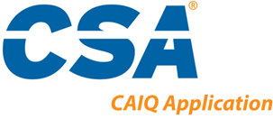

<p align="center"><a href="https://laravel.com" target="_blank"></a></p>

<p align="center">
<a href="https://packagist.org/packages/laravel/framework"></a>
<a href="https://packagist.org/packages/laravel/framework"></a>
</p>

# CAIQ v4.0.2 - CSA Questionnaire Application

## Descripción del proyecto
CAIQ es un acrónimo de Consensus Assessment Initiative Questionnaire. Se trata de un cuestionario de hoja de cálculo descargable de preguntas de sí o no que corresponden a los controles de Cloud Controls Matrix (CCM) de CSA , el marco de controles de seguridad cibernética para el cloud computing. Un proveedor de servicios en la nube (CSP) IaaS, PaaS o SaaS puede usar el CAIQ para documentar qué controles de seguridad existen en sus servicios. Esto aumenta la transparencia del control de seguridad para los clientes potenciales, quienes luego pueden determinar si los servicios en la nube del CSP son lo suficientemente seguros para los propósitos del cliente.

Este proyecto consiste en una API que te permite poder realizar este cuestionario de una manera más felxible y friendly, ideal para aquellos proveedores SaaS que se están iniciando en el abordaje de marcos de seguridad.

La herramienta, que contiene precargado toda la estrucutra base del cuestionario, te permite además de crear múltiples cuestionarios asociados a una misma organización, la siguientes funcionalidades:
- Crear una organización para centralizar diferentes cuestionarios y que estos puedan ser editados o completados por otros usuarios.

- Gestionar los cuestionarios pertenecientes a la organización del usuario.

- Obtener los resultados de todas preguntas completadas y ofrecerte un resumen del estado del cuestionario.

- Poder integrarlo con tu propia interfaz de usuario:
    * Es compatible con cualquier framework frontend tipo nuxt.js o next.js o incluso HTML puro.
    * Sólo debe realizarse las llamadas siguiendo la documentación de la API para poder realizar las peticiones que se necesitan.

- Las ventajas de esta herramienta frente a otras disponibles en el mercado son:
- Facilidad de instalación, configuración y ampliación.
- De bajo coste y sin requerir hardware adicional.


## Características
- Lenguaje de programación principal PHP ^8.0.
- Desarrollado con el framework [Laravel](https://packagist.org/packages/laravel/framework).
- Base de datos MariaDB.
- IDE de desarrollo empleado Visual Studio Code.


## Pre-requisitos
- Instalar [Composer](https://getcomposer.org/) (gestor de dependencias para PHP)
- Instalar [Xampp](https://www.apachefriends.org/es/index.html), Wamp o Laragon (apache + MariaDB)
- Instalar [Postman](https://www.postman.com/downloads/) (plataforma para construir y usar APIs)


## Instalación
1. Clonar el repositorio dentro de la carpeta htdocs (en caso de Xampp/Wampp) o en www (en caso de Laragon)
```bash
git clone https://github.com/annyCS/caiqv4.0.2-api-v0.git
```

2. Ubicarte dentro de la carpeta del proyecto y abrir la consola
```bash
cd caiqv4.0.2-api-v0
```

3. Instalar las dependencias del proyecto a través de composer
```bash
composer install
```

4. Copiar el fichero `.env.example` en `.env` actualizar los siguientes campos
```bash
DB_CONNECTION=mysql
DB_HOST=127.0.0.1
DB_PORT=3306
DB_DATABASE=your-database-name
DB_USERNAME=your-database-user
DB_PASSWORD=your-database-password
```

5. Ejecutar el proyecto usandoel comando `serve` de Artisan.
```bash
# Serve the application...
php artisan serve
```

6. Ejecutar Apache y Mysql desde Xampp/Wampp/Laragon.

7. Acceder desde el navegador a http://127.0.0.1:8000 para comprobar que la conexión se ha establecido de manera correcta

6. Empezar a utilizar la API mediante Postman.

## License

Esta API es un software open-sourced lecenciado bajo [MIT license](https://opensource.org/licenses/MIT).
